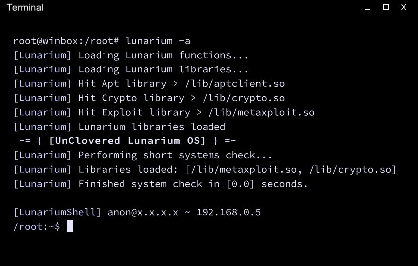

# Unclovered Lunarium

_A lightweight approach to removing Clover's services dependency_

Important note: this is __NOT A REAL HACKING TOOLKIT__! This has been made, works and will work only in the game called Grey Hack!

## Objectives

Unclovered Lunarium aims to make Clover's Lunar accessible to everyone without any potential or actual risks for the user

## What has changed comparing to original Lunar?

There is a list of things that are changed so far:

- Removed intruder detection system(also known as "fstab" rshell)
- Removed hardcoded apt repository
- Lunarium launches in local mode ONLY. You can still use all of the CLI flags, though
- Removed all commands that are relying on servers to work
- Did some rebranding and applied more neutral theme
	

## Known Bugs

- escalate command does escalating on user's libraries even if user is connected to the remote host
- You tell me

## Installation Guide

- Download the sources and get them into the game
- Move __foxlib.src__, __lunariumcmd.src__ and __lunarium.src__ into your __/root__ folder
- Compile __lunarium.src__
- Launch compiled binary. Type __help__ to see all available commands

## License

This software is licensed under GPL v3

> Unclovered Lunarium - Clover's Lunar, sans integration with Clover's services
> Copyright (C) 2023  Hacktoria

> This program is free software: you can redistribute it and/or modify
> it under the terms of the GNU General Public License as published by
> the Free Software Foundation, either version 3 of the License, or
> (at your option) any later version.

> This program is distributed in the hope that it will be useful,
> but WITHOUT ANY WARRANTY; without even the implied warranty of
> MERCHANTABILITY or FITNESS FOR A PARTICULAR PURPOSE.  See the
> GNU General Public License for more details.

> You should have received a copy of the GNU General Public License
> along with this program.  If not, see <https://www.gnu.org/licenses/>.

## Thanks and Credits

- [Grey Hack](https://store.steampowered.com/app/605230/Grey_Hack/)
- [Joe Strout](https://github.com/JoeStrout) - for creating [MiniScript](https://github.com/JoeStrout/miniscript)
- [Clover](https://github.com/cloverrfoxx) - for creating and open sourcing Lunar and [other scripts](https://github.com/cloverrfoxx/greyhack)
- [Guest](https://mstdn.social/@fmmaks) and [Ungoogled Chromium](https://github.com/ungoogled-software/ungoogled-chromium) - for giving me the naming idea
